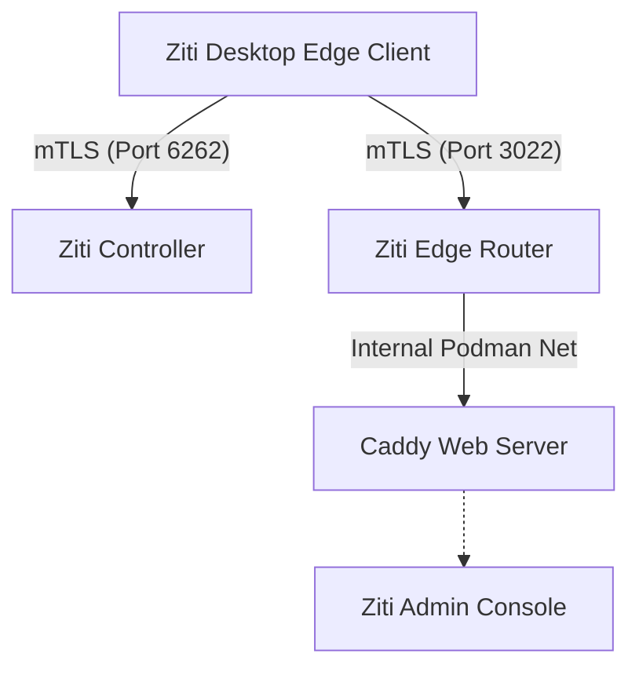

# OpenZiti Rootless Podman Deployment

This project deploys a secure, "dark" OpenZiti network backbone using **Rootless Podman**. The architecture is designed to minimize the attack surface by exposing only the necessary Ziti transport ports to the public internet, while keeping the management console (ZAC) and other services completely hidden inside the Ziti Overlay Network.

## Architecture

The deployment consists of three main containers running in a shared Podman network (`ziti-stack_ziti-net`):

1.  **Ziti Controller (`ziti-controller`)**:
    *   **Role**: The brain of the network. Manages identities, policies, and configurations.
    *   **Networking**: Listens on port `6262`.
    *   **Availability**: Exposed to the internet via Caddy reverse proxy (optional) or directly via Edge Router depending on configuration. In this setup, it is reachable at `zt.moscaville.com:6262` for enrollment and API access.

2.  **Ziti Edge Router (`ziti-router`)**:
    *   **Role**: The gateway to the Ziti Fabric. Handles data plane traffic.
    *   **Networking**:
        *   **Host Port**: `3022` (Public).
        *   **Container Port**: `10080` (Internal).
        *   **Binding**: Listens on `0.0.0.0:10080` inside the container.
        *   **Advertising**: Advertises itself as `zt.moscaville.com:3022`.
    *   **Function**: Accepts encrypted mTLS connections from Ziti Clients (Edge) and routes traffic to services.

3.  **Caddy (Zitified)**:
    *   **Role**: A "Dark" web server hosting the Ziti Admin Console (ZAC) and serving as the internal reverse proxy.
    *   **Networking**: **No public ports opened.** It uses the OpenZiti Go SDK to bind directly to the overlay network.
    *   **Access**: Only accessible via the Ziti Network.



## How It Works

1.  **Deployment**: The `deploy-ziti.sh` automation initializes the Controller and Router, generates certificates, and patches the configurations to ensure they work correctly with Podman's rootless networking (port mapping 3022 -> 10080).
2.  **Identity Creation**: The script generates a Ziti Identity (`mac-m4-gold`) for you (the admin).
3.  **Service Setup**: It creates a "Ziti Service" named `zac-service` that intercepts traffic for `100.64.0.10` and offloads it to the Caddy container.
4.  **Access**:
    *   You enroll the `mac-m4-gold.jwt` on your laptop.
    *   The Ziti Client intercepts requests to `http://100.64.0.10/`.
    *   The request is encapsulated in mTLS, sent to the Edge Router (port 3022).
    *   The Router forwards the request to Caddy.
    *   Caddy serves the ZAC.

**Security Note**: The traffic between your laptop and the Router is encrypted (mTLS). The traffic between the Router and Caddy is inside the private server network. We use `HTTP` (Port 80) for the final hop to avoid double-encryption complexity, but the end-to-end connection remains secure.

## Installation & Usage

### 1. Prerequisites
*   A Linux host with `podman` installed.
*   DNS A record pointing to your host (e.g., `zt.moscaville.com`).
*   Firewall ports `6262/tcp` and `3022/tcp` open.

### 2. Deploy
1.  Configure your environment:
    ```bash
    cp .env.example .env
    nano .env
    # Set ZITI_PWD, ZITI_CTRL_ADVERTISED_ADDRESS, etc.
    ```
2.  Run the deployment:
    ```bash
    ./deploy-ziti.sh
    ```
    This script is idempotent and handles config patching, permission fixes, and container startup.

### 3. Accessing the Console
1.  Locate the identity token generated by the script:
    ```bash
    ls -l mac-m4-gold.jwt
    ```
2.  Copy this file to your local computer (Mac/Windows/Linux).
3.  Import it into your **Ziti Desktop Edge** (or Ziti Tunnel) application.
4.  Once the service `zac-service` is available (green) in your client:
    *   Open your browser.
    *   Navigate to: **[http://100.64.0.10/zac/](http://100.64.0.10/zac/)**
5.  Log in with `admin` and the password you set in `.env`.

## Troubleshooting

*   **"Connection Refused" on Client**: Ensure Host Firewall allows TCP 6262 and 3022. Verify with `nc -vz <domain> 3022`.
*   **"SSL Protocol Error" / "Empty Response"**: Make sure you are using `http://` and not `https://` for the local address `100.64.0.10`.
*   **Router fails to start**: Check logs with `podman logs ziti-router`. Common issues include permission errors on `./router-data` (ensure owned by container user or `chmod 777`).
*   **Containers not communicating**: Inspect the podman network: `podman network inspect ziti-stack_ziti-net`.

## Maintenance
*   **Logs**: `deploy-ziti.log` contains the full output of the last deployment run.
*   **Teardown**: To remove everything (containers, volumes, data):
    ```bash
    ./teardown.sh
    ```
*   **Restart**:
    ```bash
    podman restart ziti-controller ziti-router caddy
    ```