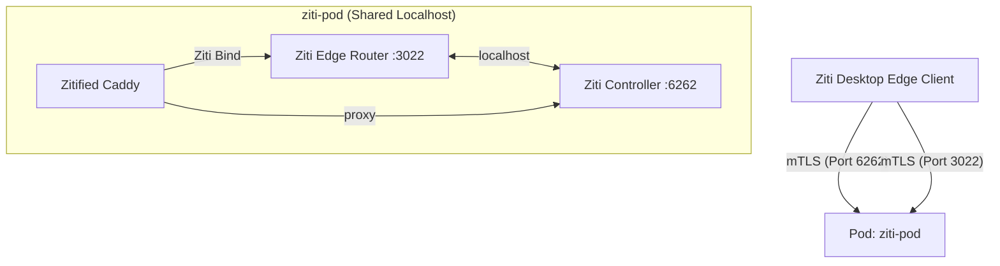

# OpenZiti Rootless Podman Deployment (Pod Architecture)

This project deploys a secure, "dark" OpenZiti network backbone using **Rootless Podman**. The architecture uses a **Single Pod** strategy to handle complex networking scenarios (like Single-Host deployments behind NAT) without requiring complex firewall hair-pinning or host-level port forwarding.

The Management Console (ZAC) and other services are completely hidden inside the Ziti Overlay Network, exposed only via a Zitified Caddy reverse proxy.

## Architecture

The deployment runs entirely within a single Podman Pod (`ziti-pod`), ensuring all components share the `localhost` network namespace.

1.  **Ziti Controller (`ziti-controller`)**:
    *   **Role**: The brain of the network. Manages identities, policies, and configurations.
    *   **Networking**: Listens on `localhost:6262` inside the Pod.
    *   **Availability**: Exposed to the internet via Pod Port Mapping (Host:6262 -> Pod:6262).
    *   **Split Horizon**: 
        *   **External**: Reached as `zt.example.com:6262`.
        *   **Internal**: Reached by Caddy/Router as `localhost:6262` or `ziti-controller:6262`.

2.  **Ziti Edge Router (`ziti-router`)**:
    *   **Role**: The gateway to the Ziti Fabric. Handles data plane traffic.
    *   **Networking**: Listens on `localhost:3022` inside the Pod (Unified Port).
    *   **Availability**: Exposed to the internet via Pod Port Mapping (Host:3022 -> Pod:3022).
    *   **Advertising**: Advertises itself as `zt.example.com:3022`.
    *   **Function**: Accepts encrypted mTLS connections from Ziti Clients (Edge) and routes traffic to services.

3.  **Caddy (Zitified)**:
    *   **Role**: A "Dark" web server hosting the Ziti Admin Console (ZAC) and serving as the internal reverse proxy.
    *   **Networking**: **No public ports opened.** It uses the OpenZiti Go SDK to bind directly to the overlay network.
    *   **Access**: Only accessible via the Ziti Network.
    *   **Split DNS**: It maps `zt.example.com` to `127.0.0.1` locally, allowing it to connect to the Router and Controller via the Pod's shared loopback interface, regardless of the external IP.



## How It Works

1.  **Deployment**: The `deploy-ziti.sh` automation creates a Pod, initializes the Controller and Router, generates certificates valid for `localhost`, and patches configurations to bind to `0.0.0.0` inside the Pod.
2.  **Identity Creation**: The script generates a Ziti Identity (`admin-gold`) for you (the admin).
3.  **Service Setup**: It creates a "Ziti Service" named `zac-service` that intercepts traffic for `zac.internal` (and `100.64.0.10`) and offloads it to the Caddy container.
4.  **Access**:
    *   You enroll the `admin-gold.jwt` on your laptop.
    *   The Ziti Client intercepts requests to `http://zac.internal/`.
    *   The request is encapsulated in mTLS, sent to the Edge Router (External Port 3022).
    *   The Router forwards the request to Caddy.
    *   Caddy serves the ZAC.

## Installation & Usage

### 1. Prerequisites
*   A Linux host with `podman` installed.
*   DNS A record pointing to your host (e.g., `zt.example.com`).
*   Firewall ports `6262/tcp` and `3022/tcp` open.
*   **Tailscale Note**: If using Tailscale, avoid using the `100.x.x.x` intercept range if possible, or use the DNS-based intercept (`zac.internal`) to avoid routing conflicts.

### 2. Deploy
1.  Configure your environment:
    ```bash
    cp .env.example .env
    nano .env
    # Set ZITI_PWD, ZITI_CTRL_ADVERTISED_ADDRESS=zt.example.com
    ```
2.  Run the deployment:
    ```bash
    ./deploy-ziti.sh
    ```
    This script is idempotent and handles config patching, permission fixes, and container startup.

### 3. Accessing the Console
1.  Locate the identity token generated by the script:
    ```bash
    ls -l admin-gold.jwt
    ```
2.  Copy this file to your local computer (Mac/Windows/Linux).
3.  Import it into your **Ziti Desktop Edge** (or Ziti Tunnel) application.
4.  Once the service `zac-service` is available (green) in your client:
    *   Open your browser.
    *   Navigate to: **[http://zac.internal/zac/](http://zac.internal/zac/)**
5.  Log in with `admin` and the password you set in `.env`.
    *   **Controller URL**: If prompted, use `https://zt.example.com:6262` (External Address).

## Troubleshooting

*   **"Connection Refused" on Client**: Ensure Host Firewall allows TCP 6262 and 3022. Verify with `nc -vz <domain> 3022`.
*   **"Connection Timed Out" (Tailscale)**: If you run Tailscale, `100.64.0.10` might route to the Tailscale interface. Use `http://zac.internal` instead.
*   **Router fails to start**: Check logs with `podman logs ziti-router`. Common issues include permission errors on `./router-data` (ensure owned by container user or `chmod 777`).
*   **Logs**: `deploy-ziti-*.log` contains the full output of the last deployment run.

## Maintenance
*   **Teardown**: To remove everything (containers, volumes, data):
    ```bash
    ./teardown.sh
    ```
*   **Restart**:
    ```bash
    podman pod restart ziti-pod
    ```